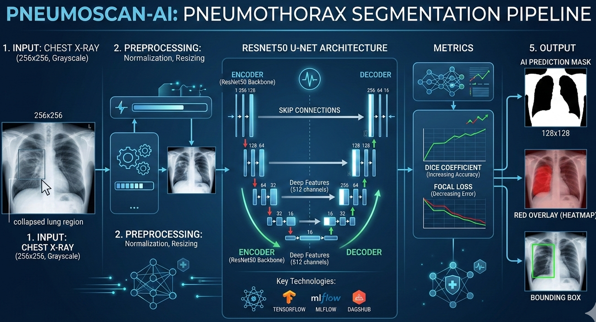

# 🩺 PneumoOps-AI

🚀 Project: Pneumonia Detection AI System (End-to-End AWS Deployment)

💼 Problem Statement  Build an AI system that detects Pneumonia from chest X-ray images and deploy it as a scalable cloud service.

[](https://www.python.org/)
[](https://tensorflow.org)
[](https://arxiv.org/abs/1505.04597)
[](LICENSE)

## 🩺 Automated Chest X-ray Segmentation System



## 1️⃣ Clone Repository

```bash
git clone https://github.com/Ahmed2797/PneumoOps-AI.git
```

### 2️⃣ Create Environment

```bash
conda create -n chest python=3.10 -y
conda activate chest
```

### Install pip packages from requirements.txt

``` bash
pip install -r requirements.txt

## 📂 Download Dataset
## smaill size
https://drive.google.com/file/d/1bo0OC0oT2o8lx7d5fBmVMEyOtBMMCBp2/view?usp=sharing
https://www.kaggle.com/c/siim-acr-pneumothorax-segmentation

## Train The model-pipeline
python main.py

## web app
python app.py

```
