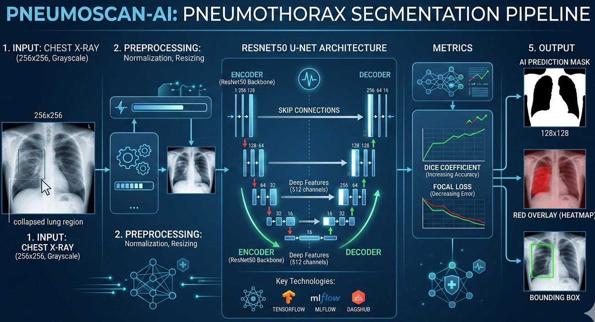

# 🩺 PneumoOps-AI

🚀 Project: Pneumonia Detection AI System (End-to-End AWS Deployment)

The system combines:

- 🧠 U-Net for lung segmentation
- 🔍 ResNet50 for image classification
- ☁️ AWS cloud deployment
- 🐳 Docker containerization
- 🔄 CI/CD automation with GitHub Actions

💼 Problem Statement  Build an AI system that detects Pneumonia from chest X-ray images and deploy it as a scalable cloud service.

🚀 End-to-End Deep Learning System for Pneumonia Detection using Chest X-ray Images with AWS Deployment

[](https://www.python.org/)
[](https://tensorflow.org/)
[](https://www.docker.com/)
[](https://aws.amazon.com/)
[](LICENSE)

## 🩺 Automated Chest X-ray Segmentation System



## 1️⃣ Clone Repository

```bash
git clone https://github.com/Ahmed2797/PneumoOps-AI.git
```

### 2️⃣ Create Environment

```bash
conda create -n chest python=3.10 -y
conda activate chest
```

### Install pip packages from requirements.txt

``` bash
pip install -r requirements.txt

## 📂 Download Dataset
## smaill size
https://drive.google.com/file/d/1bo0OC0oT2o8lx7d5fBmVMEyOtBMMCBp2/view?usp=sharing
https://www.kaggle.com/c/siim-acr-pneumothorax-segmentation

## .env
AWS_ACCESS_KEY_ID = your_access_key_here
AWS_SECRET_ACCESS_KEY = your_secret_key_here
AWS_DEFAULT_REGION = us-east-1

export AWS_ACCESS_KEY_ID = "YOUR_ACCESS_KEY_ID"
export AWS_SECRET_ACCESS_KEY = "YOUR_SECRET_ACCESS_KEY"


## Load-Data
python gdown_push_s3.py
## Train The model-pipeline
python main.py

## web app
python app.py
## Now open up you local host and port
```

## AWS-CICD-Deployment-with-Github-Actions

### 1. Login to AWS console

### 2. Create IAM user for deployment

``` bash
# with specific access
1. EC2 access : It is virtual machine

2. ECR: Elastic Container registry to save your docker image in aws

#Description: About the deployment

1. Build docker image of the source code

2. Push your docker image to ECR

3. Launch Your EC2 

4. Pull Your image from ECR in EC2

5. Lauch your docker image in EC2

#Policy:

1. AmazonEC2ContainerRegistryFullAccess

2. AmazonEC2FullAccess
```

### 3. Create ECR repo to store/save docker image

- Save the URI: 520551197421.dkr.ecr.us-east-1.amazonaws.com/chestxray

### 4. Create EC2 machine (Ubuntu)

### 5. Open EC2 and Install docker in EC2 Machine

``` bash
    #optinal

    sudo apt-get update -y

    sudo apt-get upgrade

    #required

    curl -fsSL https://get.docker.com -o get-docker.sh

    sudo sh get-docker.sh

    sudo usermod -aG docker ubuntu

    newgrp docker
```

### 6. Setup github secrets

```bash

AWS_ACCESS_KEY_ID =

AWS_SECRET_ACCESS_KEY =

AWS_REGION = us-east-1

AWS_ECR_LOGIN_URI = 520551197421.dkr.ecr.us-east-1.amazonaws.com

ECR_REPOSITORY_NAME = PneumoVision-AI
```
